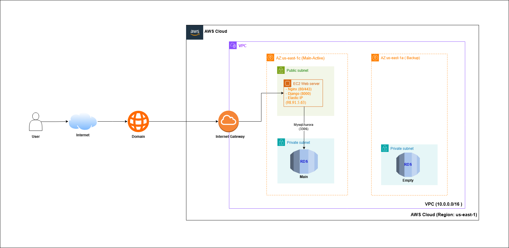

# ☁️ Cloud Database Management System (DBaaS)

> **Automated Database Provisioning and Management System on AWS Cloud.**

## 📖 Introduction

This project is a mini **Database-as-a-Service (DBaaS)** platform that allows end-users (Developers/Admins) to easily provision, manage, and delete isolated MySQL databases on Amazon Web Services (AWS) infrastructure via an intuitive web interface.

Instead of manually configuring servers and executing SQL commands, this system automates the resource provisioning workflow within a highly secure network environment.

## 🚀 Key Features

* **Secure Authentication:** Implementation of JSON Web Tokens (JWT) for secure API communication and login sessions.
* **Instant Provisioning:** Dynamically creates isolated MySQL databases and generates unique database users with strict privileges in real-time.
* **Management Dashboard:** A centralized interface to view, manage, and safely drop existing databases.
* **High Security Architecture:** Cloud-standard deployment model utilizing AWS VPC, isolating the core database in a Private Subnet.

## 🏗️ System Architecture

The infrastructure is designed following a **2-Tier VPC Architecture (Public - Private)** to ensure maximum data security:

1.  **Web Server (EC2):** Hosted in a **Public Subnet**, acting as the gateway for user interactions and API processing.
2.  **Database Engine (RDS MySQL):** Hosted in a **Private Subnet**, **NOT** publicly accessible (`Publicly Accessible: No`). 
3.  **Connection Flow:**
    * Internal applications and APIs connect directly to the RDS instance securely within the VPC.
    * Administrators connect via **SSH Tunneling** (using the EC2 Web Server as a bastion host).

## 🛠️ Tech Stack

### 1. Cloud Infrastructure (AWS)
* **AWS EC2 (Ubuntu Linux):** Virtual machine hosting the backend application and web server.
* **AWS RDS (MySQL):** Managed relational database service ensuring high availability and automated backups.
* **AWS VPC:** Virtual Private Cloud separating Public and Private Subnets.
* **Namecheap:** Domain management (`.me`) and DNS configuration pointing to the EC2 Elastic IP.

### 2. Backend & API
* **Python & Django:** Core language and framework handling business logic.
* **Django REST Framework (DRF):** Building robust RESTful APIs.
* **SimpleJWT:** Securing API endpoints with access and refresh tokens.
* **MySQL Connector Python:** Executing dynamic raw SQL commands (`CREATE DATABASE`, `GRANT PRIVILEGES`) on the RDS instance.
* **Gunicorn & Nginx:** WSGI HTTP Server and Reverse Proxy for production deployment.

### 3. Frontend
* **HTML5 & CSS3:** Semantic structure and styling.
* **Bootstrap 5:** Responsive UI framework for the dashboard layout.
* **Vanilla JavaScript:** Fetching APIs, handling asynchronous operations, and managing local storage for JWT tokens.

## ⚙️ Installation & Local Setup

### Prerequisites
* Python 3.8+
* A running MySQL instance (Local or AWS RDS) with a Master User account capable of creating new databases and users.

## 📝 License
[MIT](https://choosealicense.com/licenses/mit/)
